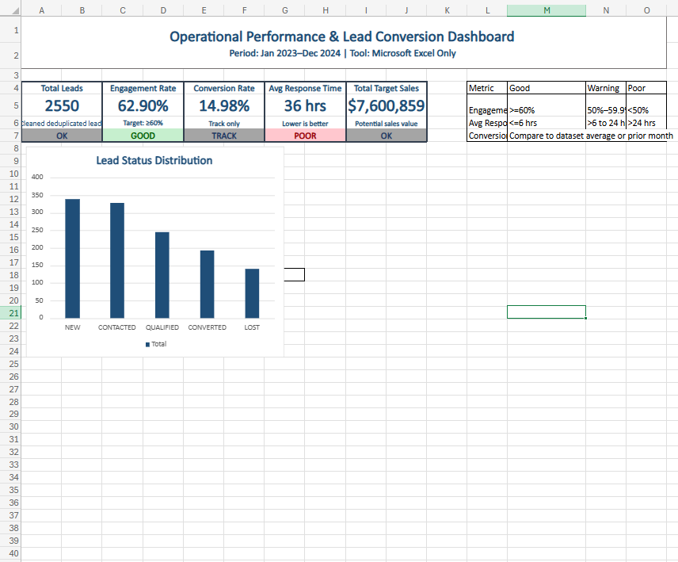
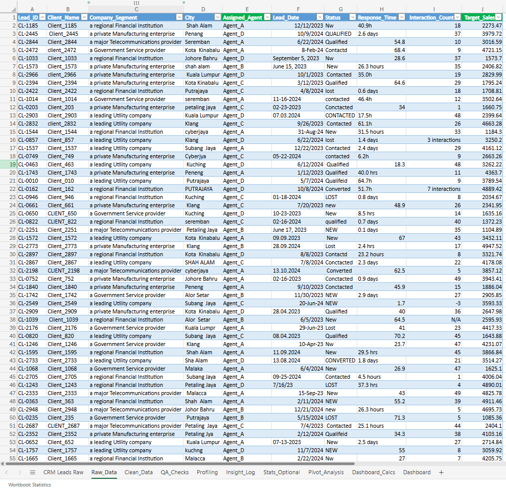
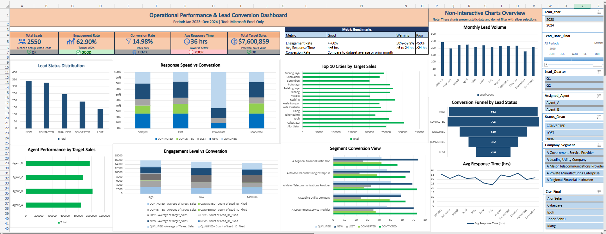

# Project A - Operational Performance & Lead Conversion Dashboard

## Overview
This project demonstrates an end-to-end data cleaning and business intelligence workflow built entirely in Microsoft Excel. I transformed a compromised CRM lead dataset of 2,999 records into a clean, analysis-ready dataset of 2,550 unique leads, then built an interactive operational dashboard for lead conversion, response speed, engagement, and agent performance.

The work focuses on practical Excel analytics: formulas, tables, data validation, conditional formatting, PivotTables, slicers, and dashboard design.

## Business Problem
A service organization needed a reliable view of CRM lead performance. The raw CRM export contained duplicate lead IDs, inconsistent status labels, mixed date formats, response-time values in different units, city spelling variations, and invalid interaction counts.

The dashboard was designed to help answer:
- Which leads are converting?
- Which agents are performing well?
- Are response times too slow?
- Is engagement reaching the target level?
- Which cities and customer segments contribute the most target value?

## Method
The project followed the APPASA workflow:

- **Assess:** Profiled the raw dataset and identified data-quality issues across all columns.
- **Prepare:** Created a controlled workbook structure, backup flow, and mapping sheets for repeatable cleaning.
- **Process:** Used Excel formulas to standardize IDs, names, cities, statuses, dates, response times, interaction counts, and sales tiers.
- **Study:** Built PivotTables and KPI calculations to analyze lead distribution, conversion rate, response speed, engagement, and agent performance.
- **Act:** Designed an interactive dashboard and documented the cleaning process for portfolio review.

## Tools Used
- Microsoft Excel
- Excel Tables and structured references
- Formulas including `TRIM`, `PROPER`, `UPPER`, `VLOOKUP`, `LET`, `IFERROR`, `IFS`, `MAXIFS`, and `PERCENTILE.INC`
- PivotTables, charts, slicers, and timeline filters
- Data validation and conditional formatting

## Key Outputs
- Cleaned 2,999 raw CRM records into 2,550 unique lead records.
- Resolved 449 duplicate lead records.
- Standardized 23 raw status variants into 5 pipeline stages.
- Converted mixed response-time units into hours.
- Created engagement, conversion, stage-order, response-speed, and sales-tier fields.
- Built an Excel dashboard for operational performance review.

## Dashboard Features
- KPI cards for total leads, engagement rate, conversion rate, average response time, and total target sales.
- Funnel and trend views for pipeline monitoring.
- Breakdowns by agent, city, customer segment, status, response speed, and engagement level.
- Slicers and timeline filters for interactive exploration.
- QA views for validating the cleaned dataset.

## Key Insights
- Standardized Excel cleaning replaced unreliable raw data with a repeatable reporting dataset.
- Leads contacted within 6 hours showed stronger conversion potential.
- Higher engagement levels were tied to stronger lead outcomes.
- Target value was concentrated in specific cities and segments.
- The dashboard gives a clearer way to monitor lead health, agent workload, and operational follow-up.

## Project Structure
- `workbook/operation_performance_dashboard.xlsx` - Excel workbook with cleaning steps, analysis, and dashboard.
- `data/cleaned/crm_leads_cleaned_analysis_ready.csv` - Cleaned analysis-ready CSV export.
- `docs/cleaning_log.md` - Step-by-step cleaning documentation.
- `docs/data_dictionary.md` - Field definitions for the cleaned dataset.
- `docs/executive_summary.md` - Portfolio-ready project summary.
- `images/` - Dashboard, QA, validation, and cleaning screenshots.

The raw CSV file is intentionally excluded from the repository. The cleaned CSV and workbook are included for portfolio review.

## Screenshots

### Final Dashboard

### Before and After

### Raw Data Sample

### QA Dashboard

## How to Open the Workbook
1. Open `workbook/operation_performance_dashboard.xlsx` in Microsoft Excel.
2. Review the `Raw_Data`, `Clean_Data`, `Dashboard_Calcs`, and `Dashboard` sheets.
3. Use the dashboard slicers and timeline filters to explore performance.
4. Use `data/cleaned/crm_leads_cleaned_analysis_ready.csv` if you only need the cleaned static dataset.

## Contact
This project is part of my professional data analytics portfolio.

- **Name:** Muhammad Harith Bin Jamal
- **Role Focus:** Junior Data Analyst / Business Intelligence
- **Certifications:** Google Data Analytics Professional Certificate, Macquarie University Excel Skills for Business
- **GitHub:** [mHarith2001](https://github.com/mHarith2001)
- **LinkedIn:** [Muhammad Harith](https://www.linkedin.com/in/muhammad-harith-4376332a0/)
