# Data Cleaning Log - Project A Operation Performance

**Date:** 2026-06-16  
**Analyst:** Muhammad Harith Bin Jamal  
**Tool:** Microsoft Excel

## 1. Profiling
- **Action:** Created a profiling sheet to establish the starting dataset size and inspect structural issues before cleaning.
- **Formula:** `=ROWS(Table1[Lead_ID])`
- **Result:** Confirmed the dataset contained 2,999 raw records and identified the main data-quality issues for correction.
- **Why:** Profiling created the baseline used to validate each later cleaning step.

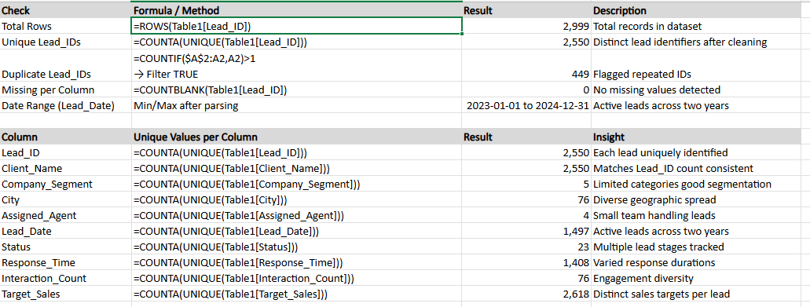

## 2. Lead ID - Standardize and Flag Duplicates
- **Action:** Standardized `Lead_ID` values with `TRIM`, `UPPER`, and a `CL-` prefix. Added a duplicate flag to identify repeated lead records.
- **Formula:** `=IF(COUNTIF($A$2:A2,"CL-"&TRIM(UPPER(Table1[@[Lead_ID]])))>1,"Duplicate","CL-"&TRIM(UPPER(Table1[@[Lead_ID]])))`
- **Result:** Created a consistent lead ID format and identified 449 duplicate records.
- **Why:** Consistent IDs are required before deduplication and lead-level analysis.

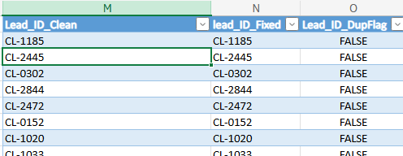

## 3. Client Name - Standardize Client Labels
- **Action:** Cleaned client names with `PROPER`, `TRIM`, and underscore replacement.
- **Formula:** `=SUBSTITUTE(TRIM(PROPER([@[Client_Name]]))," ","_")`
- **Result:** Client names became consistent and easier to sort, filter, and analyze.
- **Why:** Standardized labels reduce reporting noise and improve dashboard readability.

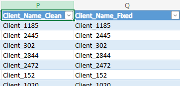

## 4. City - Standardize City Names
- **Action:** Created a `City_Mapping` sheet to correct spelling and formatting variations. Added `City_Clean` and `City_Final_Corrected` helper columns.
- **Formula:** `=IFERROR(VLOOKUP([@[City_Clean]],City_Mapping!A:B,2,FALSE),[@[City_Clean]])`
- **Result:** Consolidated 68 city-name variations into a clean city list.
- **Why:** Regional reporting depends on consistent city names.

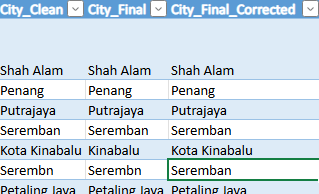
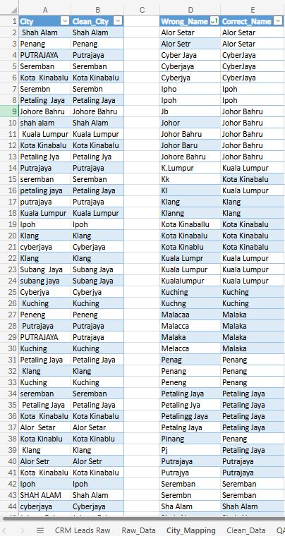

## 5. Status - Standardize Pipeline Stages
- **Action:** Created a `Status_Norm` helper column, mapped 23 status variants into 5 standard stages, and added binary flags for conversion and engagement.
- **Formula:** `=IFERROR(VLOOKUP([@[Status_Norm]],Status_Mapping!D:E,2,FALSE),[@[Status_Norm]])`
- **Result:** Reduced messy status labels into `New`, `Contacted`, `Qualified`, `Converted`, and `Lost`.
- **Why:** Standardized statuses make funnel analysis and conversion tracking reliable.

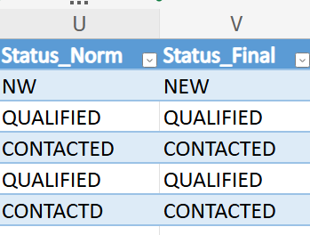
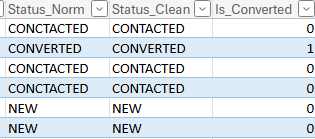
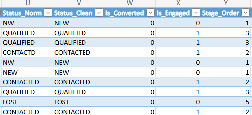
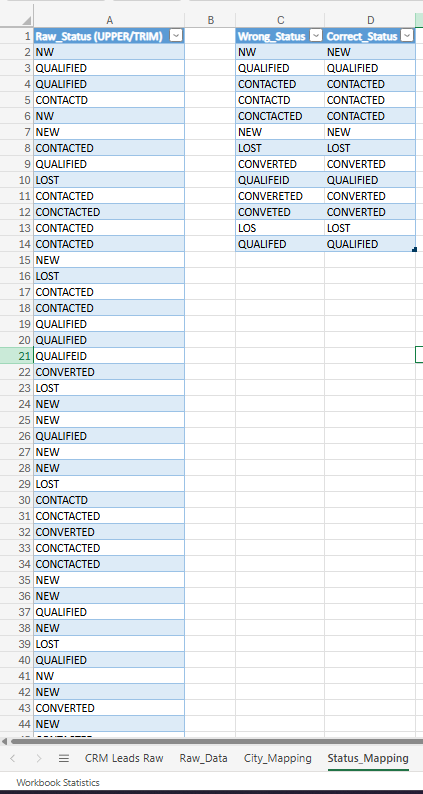

## 6. Lead Date - Standardize Dates and Keep Latest Duplicate
- **Action:** Converted mixed date formats into a single Excel-readable date field. Added month, year, quarter, weekday, and duplicate-resolution helper fields.
- **Formula:** `=LET(txt,TRIM([@Lead_Date]),...)`
- **Result:** Created valid lead dates from January 2023 through December 2024 and kept the latest record for each duplicate lead.
- **Why:** Clean dates are required for time-series analysis, slicers, and latest-record deduplication.

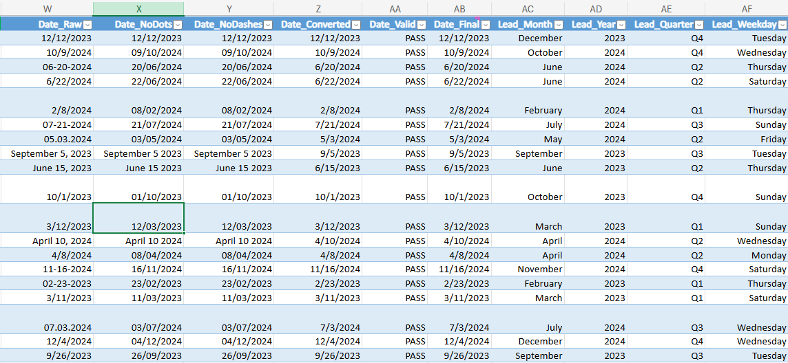
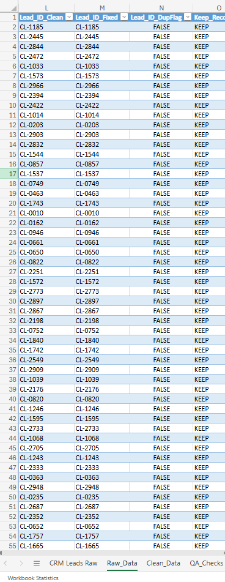

## 7. Response Time - Convert to Hours
- **Action:** Standardized response-time values written as hours, days, text strings, and abbreviations. Created `Response_Time_Hours` and response-speed categories.
- **Formula:** `=IFS(ISNUMBER(SEARCH("h",[@[Response_Time]])),VALUE(LEFT([@[Response_Time]],LEN([@[Response_Time]])-1)),...)`
- **Result:** Converted mixed response-time units into a comparable numeric hour value.
- **Why:** Response-time analysis requires one consistent unit.

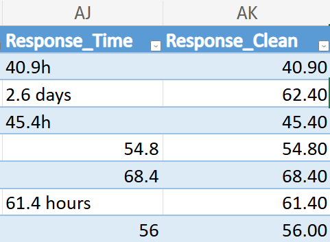
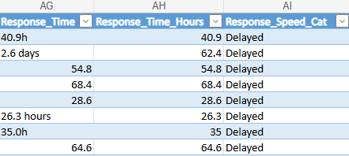

## 8. Interaction Count - Standardize Interaction Values
- **Action:** Cleaned interaction counts with `LET`, `TRIM`, `ABS`, and `IFERROR`. Added engagement categories for dashboard analysis.
- **Formula:** `=LET(txt,TRIM([@Interaction_Count]),IFERROR(ABS(VALUE(txt)),txt))`
- **Result:** Converted negative values into positive counts while preserving invalid text labels for review.
- **Why:** Engagement reporting needs consistent numeric interaction values.

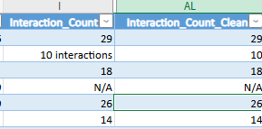
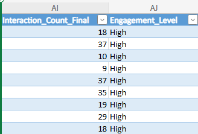

## 9. Target Sales - Categorize Sales Tiers
- **Action:** Checked numeric target sales values and created `Sales_Tier` groups using percentile thresholds.
- **Formula:** `=IF(J2<=PERCENTILE.INC(Table1[Target_Sales],0.25),"Low",IF(J2<=PERCENTILE.INC(Table1[Target_Sales],0.75),"Medium","High"))`
- **Result:** Grouped target sales into `Low`, `Medium`, and `High` tiers.
- **Why:** Sales tiers make it easier to prioritize high-value leads.

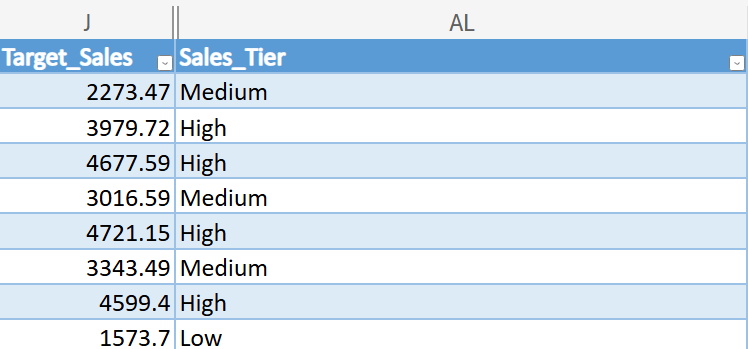

## 10. Data Validation Rules
- **Action:** Applied data validation to key fields in `tbl_CleanLeads`, including status, agent, response time, interaction count, and lead date.
- **Result:** Reduced the risk of invalid manual updates in the cleaned dataset.
- **Why:** Validation helps keep future CRM updates consistent.

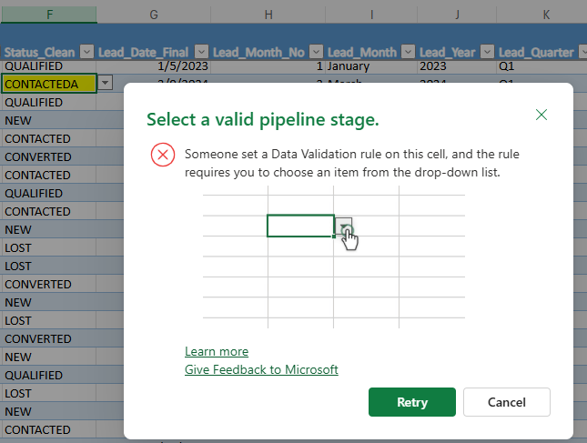
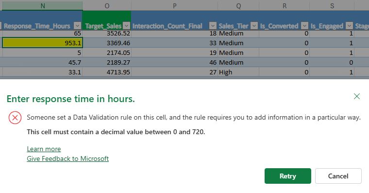
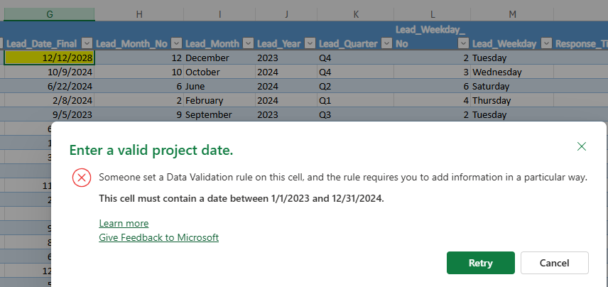

## 11. Conditional Formatting
- **Action:** Applied conditional formatting to highlight duplicate IDs, high response times, missing values, converted leads, and missing city values.
- **Result:** Made data-quality issues easier to review visually.
- **Why:** Visual QA helps catch problems before they affect the dashboard.

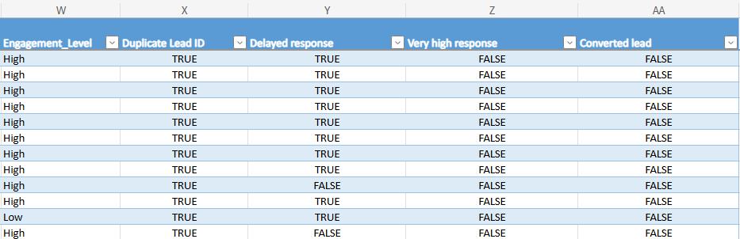

## Insight Questions
- **Pipeline:** Which status holds the largest share of leads?
- **Conversion:** Which customer segment achieves the highest conversion rate?
- **Response Speed:** Do faster response times improve conversion outcomes?
- **Agent Performance:** Which agents handle the highest volume and which convert best?
- **Geography:** Which cities contribute the most lead volume and target value?
- **Engagement:** Are more interactions associated with better conversion?
- **Time Trend:** Are lead volume and response speed improving over time?

## Final QA
- **Raw records reviewed:** 2,999
- **Rows after cleaning:** 2,550
- **Duplicate `Lead_ID_Fixed`:** 0
- **Date failures:** 0
- **Status unmapped:** 0
- **Formula errors:** 0
