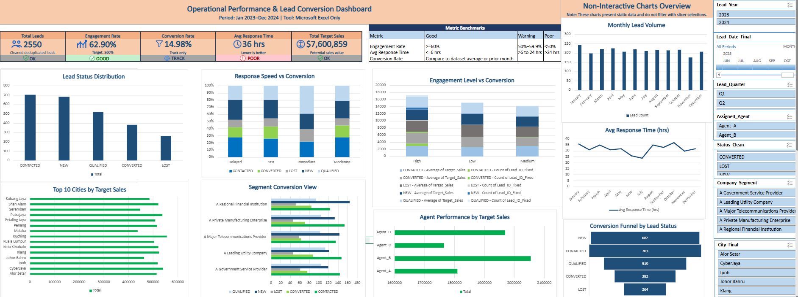

# Executive Summary - Operational Performance and Lead Conversion Dashboard

## Business Context
A service organization needed a reliable way to monitor CRM lead performance. The original CRM export contained duplicate lead IDs, inconsistent status labels, mixed date formats, response-time values in different units, city typos, and invalid interaction values.

## Objective
Build an Excel-only workflow to clean the data, create an analysis-ready dataset, and design an interactive dashboard that helps stakeholders monitor lead conversion, engagement, response speed, agent workload, and operational performance.

## Method
1. Profiled 2,999 raw lead records.
2. Standardized IDs, client names, cities, statuses, dates, response times, and interaction counts.
3. Resolved duplicate leads by keeping the latest valid lead record.
4. Built `tbl_CleanLeads` as the dashboard source.
5. Created PivotTables, KPI formulas, and an interactive Excel dashboard.

## Data Cleaning Summary
- **Raw records reviewed:** 2,999
- **Final unique leads:** 2,550
- **Duplicate lead rows resolved:** 449
- **Status variants standardized:** 23 variants reduced to 5 categories
- **Date formats standardized:** Multiple formats converted to standard Excel dates
- **Response time standardized:** Mixed units converted to hours

## Dashboard

## Portfolio Value
This project demonstrates data cleaning, quality control, feature engineering, PivotTable analysis, KPI design, dashboard development, and business communication using Microsoft Excel.
